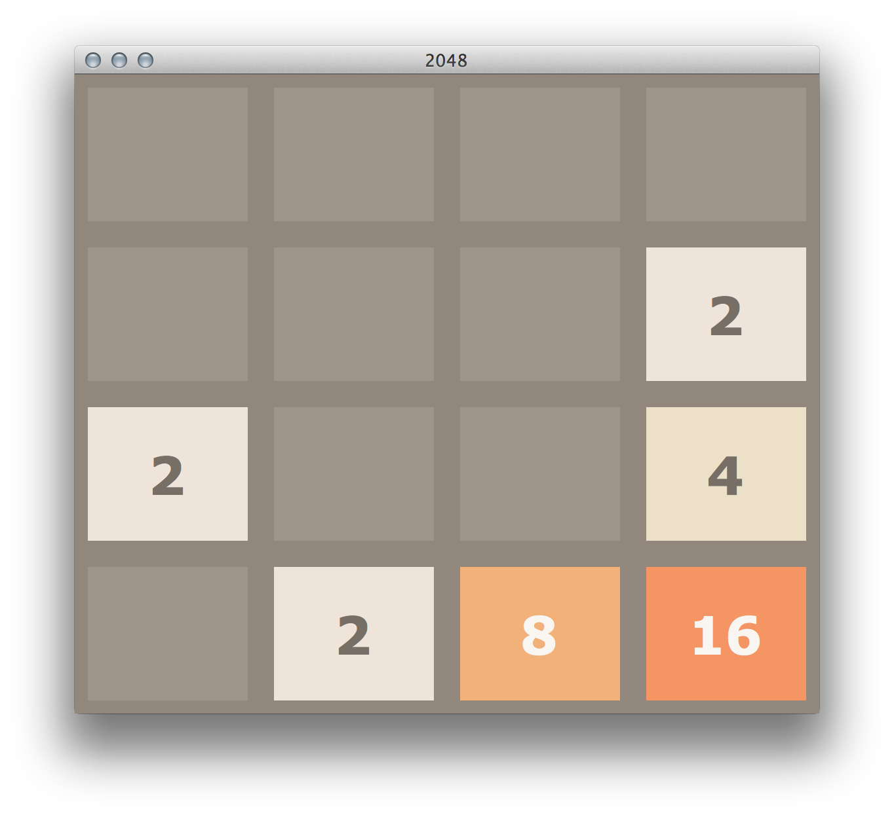

2048 Python
===========

---

**⚠️NOTE⚠️**: We won't be accepting any contributions/changes to the project anymore. It is now readonly.

---

Based on the popular game [2048](https://github.com/gabrielecirulli/2048) by Gabriele Cirulli. The game's objective is to slide numbered tiles on a grid to combine them to create a tile with the number 2048. Here is a Python version that uses TKinter! 

To start the game, run:
    
    $ python3 puzzle.py

Contributors:
==

- [Yanghun Tay](http://github.com/yangshun)
- [Emmanuel Goh](http://github.com/emman27)
